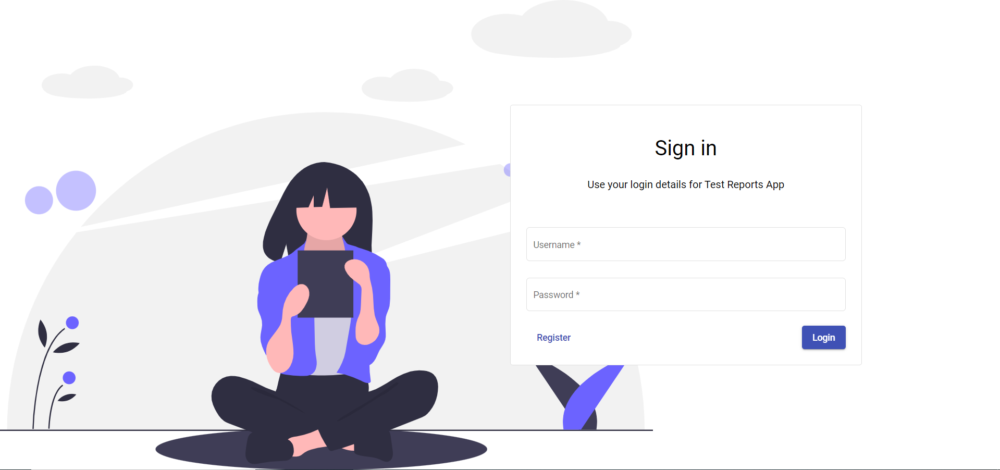
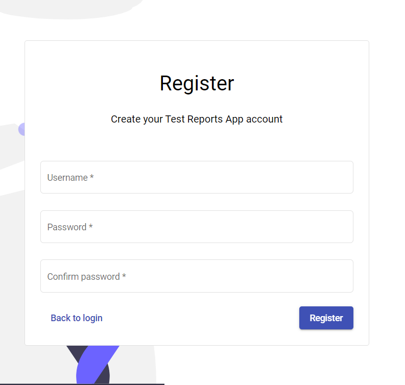
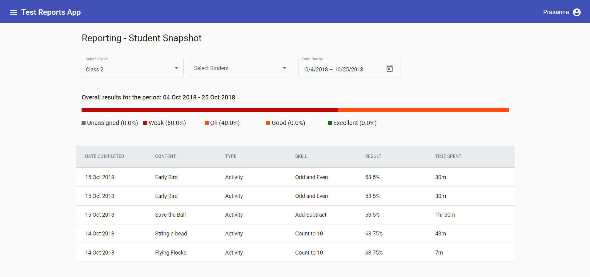
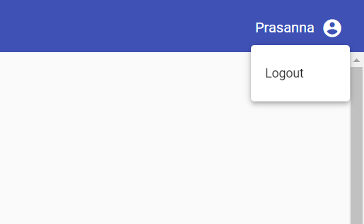

# TestApplication

This Assignment App was generated with [Angular CLI](https://github.com/angular/angular-cli) version 12.0.0.

## Dependencies

Node Version : 14.15.0

Angular Version : 12.0.0

## Development server

Run `npm install`

Run `npm start` for a dev server. 

Navigate to `http://localhost:4200/`. The app will automatically reload if you change any of the source files.

## Sample screens

## Features

1. Login, register and logout with validations with simple usability aspects.
1. Report filter with class, student and date range with missing student activity entries. 
   (Assumptions - Completed date is the latest attempt date and average of values considered on it) 
1. Horizontal stacked bar chart when only class filter applied.
